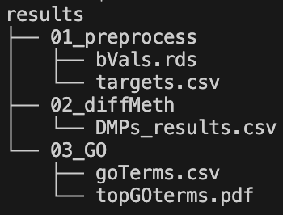
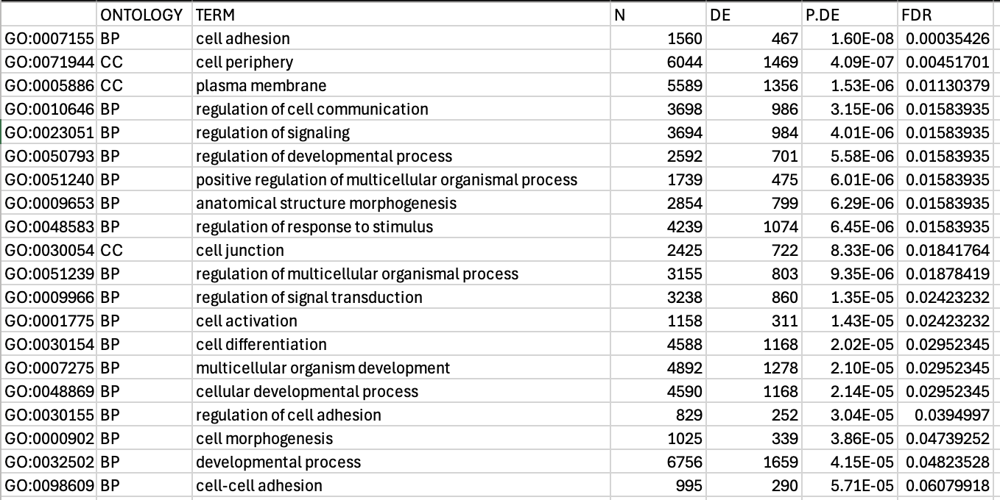
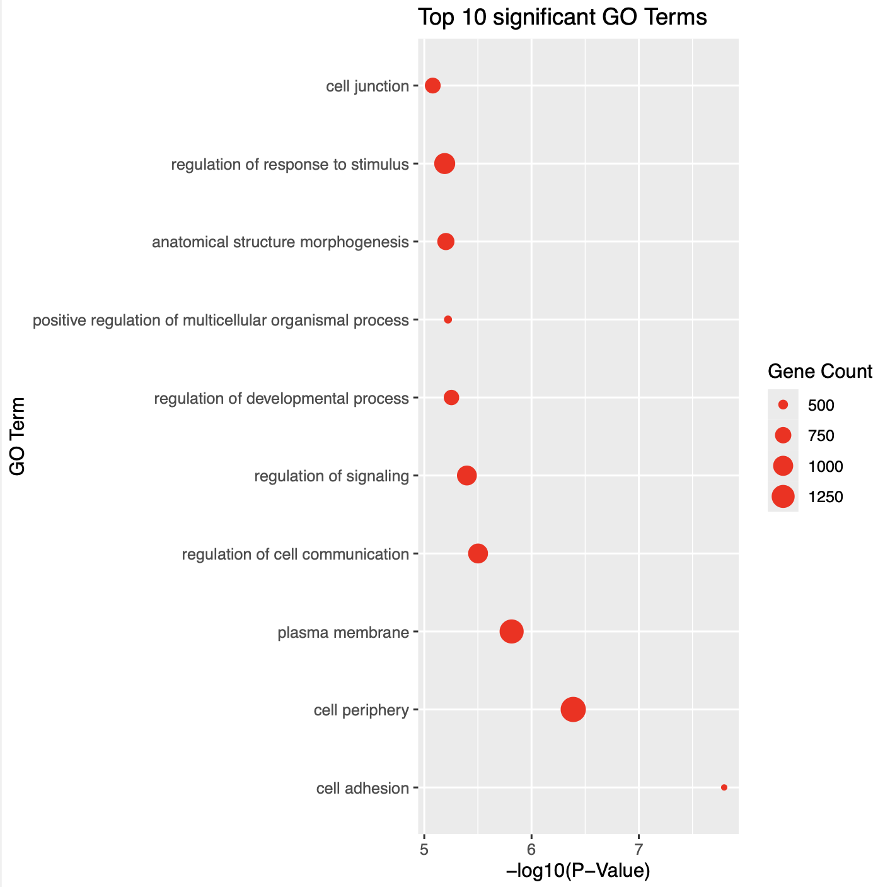

# BIOF_501-Nextflow-Pipeline
## **By Steven Chen**
--- 
## Repository Contents
--- 
**Directories**
- `input`: contains all the raw `idat` files and the sample sheet used as input for the workflow \
- `images`: contains the `.svg` file of the workflow summary image in this README.md file \
- `bins`: contains all the `.R` scripts that run the analysis \
- `results`: this results will be created by the workflow as the Nextflow pipeline runs, updating after each process step \
- `work`: this is generated by Nextflow and stores any intermediate files throughout the pipeline \

**Files**
- `methylationMain.nf`: this is the Nextflow file that contains all the processes and the workflow call itself \
- `nextflow.config`: this is the configuration file that sets some parameters for Nextflow, such as specifying the Docker container \
- `README.md`: this is the markdown file that provides usage and summary information regarding this repository \

## Pipeline Overview
--- 
This pipeline takes raw methylation .IDAT files from Illumina EPIC/EPICv2 array data using a comprehensive Nextflow workflow. Preprocessing, differential methylation probe (DMP) identification, and gene ontology (GO) enrichment analysis steps are performed using **R** packages to create an end-to-end analysis pipeline. 

## Background
---
Analyzing the human epigenome can reveal key factors and drivers of human health and disease. One integral component of epigenetic analysis is the investigation of methylation data. DNA methylation is the addition of methyl groups to nucleotides (most often cysteine), creating areas of methylation known as CpG sites. Gene methylation can lead to downstream regulatory effects on gene expression. Increases (hypermethylation) and decreases (hypomethylation) have been found to be associated with many diseases such as cancer [1], neuro-developmental disease [2], and osteperosis [3]. Thus, it is imperative that we leverage methylation data to investigate characteristics of disease in order to gain a better understanding of cause, diagnosis, and treatment.

Nicolaides-Baraister syndrome (NCBRS) is an epigenetic disease with various physical manifestations such as coarse facial features, microcephaly, and neuro-developmental issues as well [4]. NCBRS has been linked to mutations in the SMARCA2 gene, a core component in epigenetic regulation [5]. Hence, the data that was used for this pipeline was generated in a paper by Chater-Diehl et al. in 2019 (GSE125367), investigating DNA methylation signatures in SMARCA2 variants in NCBRS [6]. This paper used Illumina EPIC array data to identify significant differentially methylated CpG sites and their associated functions in order to gain further insights into the mechanisms of this disease. The data contains metadata including sample ID, age, and sex. With this data, my hypothesis is that there will be significant DMPs associated with NCBRS, particularly associated with neuro-developmental GO terms. The overall aims and objectives of this pipeline will be to a) create a simple-to-run, comprehensive workflow and b) identify GO themes associated with NCBRS.

An automated workflow/pipeline such as this one is necessary for the development of the field. Given the prevalence of bioinformatics packages across various languages, there are a plethora of different ways that raw methylation data could be analyzed. However, many individuals may not be well-versed or trained in bioinformatics, highlighting a need for an easily accessible, reproducible pipeline such as this. Moreover, reproducibility is a huge issue in scientific research, leading to many false and inflated results being published [7]. Thus, new pipelines such as this one must be created to ensure reproducibility and accessibility within the bioinformatics community, promoting best-practice for future research and fostering collaboration between members across scientific disciplines.

## Usage
--- 
### Dependencies
--- 
- Nextflow (version 24.10.1 or higher) - [Click here to install](https://www.nextflow.io/docs/latest/install.html)
- Docker (version 27.3.1 or higher) - [Click here to install](https://docs.docker.com/desktop/?_gl=1*1m4ai7c*_gcl_au*MTU4MTE4OTI5MS4xNzY0NDEyMjg1*_ga*MTcwMTkxNTU0NC4xNzY0MzI2Njk2*_ga_XJWPQMJYHQ*czE3NjQ0MTIyODUkbzIkZzEkdDE3NjQ0MTIzMDAkajQ1JGwwJGgw)
--- 
### Running the Workflow
1. Clone the repository
```bash
git clone https://github.com/schen455/BIOF_501-Nextflow-Pipeline.git
```
2. Pull the raw methylation data from the NCBI GEO database (into the `/inputs` folder)
```bash
cd BIOF_501-Nextflow-Pipeline/input
```
Then
```bash
curl -O https://ftp.ncbi.nlm.nih.gov/geo/series/GSE125nnn/GSE125367/suppl/GSE125367_RAW.tar
```
or 
```bash
wget https://ftp.ncbi.nlm.nih.gov/geo/series/GSE125nnn/GSE125367/suppl/GSE125367_RAW.tar
```

3. Untar and unzip the data
```bash
tar -xvf GSE125367_RAW.tar
gunzip *.gz
```

4. Run the nextflow pipeline from the `BIOF_501-Nextflow-Pipeline` directory
```bash
nextflow run methylationMain.nf
```

## Workflow Summary
---
1. **Preprocessing** using `minfi`\
a. *Filtering reads* - removing any reads with poor quality signal intensities (p < 0.05) \
b. *Normalization* - using quantile normalization to correct for technical variation across samples\
c. *Failed probe removal* - some probes may have failed during sequencing, detect and remove these probes using `minfi` to avoid introducing artifacts in downstream analyses\
d. *SNP probe removals* - remove any probes with single nucleotide polymorphisms (SNPs) at CpG sites \
e. *Generate beta values* - generate methylation beta-values (from 0 to 1), which quantify the degree of methylation (hypermethylation ~1, hypomethylation ~0) \

2. **Generate DMPs** \
a. *Create a design matrix* - design matrix created to model NCBRS vs. control, adjusting for covariates (e.g. age, sex) \
b. *Fit a linear model* - fit a linear model using the `limma` package, leveraging Empirical Bayes moderation to improve variance estimats\
c. *Generate DMPs* - use the model to generate a list of differentially methylated probes (DMPs) based on effect size and p-values, DMPs represent CpG sites where methylation levels differ significantly between NCBRS and control samples \

3. **GO analysis** \
a. *CpG annotation* - annotate the significant CpGs using the EPIC array annotation package\
b. *Filter significant DMPs* - filter for the most significant DMPs, identified using a threshold of false-detection rate (FDR) < 0.05 \
c. *GO enrichment analysis* - using the `missMethyl` package to perform GO enrichment to identify enriched GO terms among the significant DMPs\
d. *Generate plot* - using the `ggplot2` package to generate a plot of the top 10 GO terms associated with NCBRS-specific methylation changes in this data \


## Expected Output
---
### Results 

- **bVals.rds** contains the methylation beta-values used for DMP analysis
- **targets.csv** contains metadata for each corresponding sample
- **DMPs_results.csv** contains a .csv file with all the DMPs and the associated p-values and FDR-values
- **goTerms.csv** contains a list of all the enriched GO terms for a list of the most significant DMPs
- **topGOterms.pdf** is a .pdf file of a plot showing the top 10 enriched GO terms in the dataset

### Top 10 GO terms expected .csv file output 

This is is the list of the top 10 enriched GO terms. 
- **GO ID** contains the unique GO identifiers
- **ONTOLOGY** contains the category the term belongs to: Biological Process (BP), Cellular Component (CC), or Molecular Function (MF)
- **TERM** contains the descriptive terms of the GO category enriched in our list ofDMPs
- **N** is the total number of genes annotated to this GO term from the entire EPIC array background (all the genes represented by CpGs in the array)
- **DE** is the total number of differentially methylated genes in our significant DMPs that fall under this GO term
- **P.DE** is the raw p-value from the ``missMethyl`` enrichment analysis, a lower value represents stronger enrichment
- **FDR** is the False Discovery Rate-adjusted p-value, using a Benjamini-Hochberg correction, which accounts for multiple testing across all the GO terms, lower FDR values represent stronger enrichment

### Top 10 GO terms plot output

This is the plot output detailing the top 10 most enriched GO terms in our list of DMPs. On the x-axis, we see the log-transformed p-values, with the highest value being the most enriched. The y-axis contains the names of the GO terms, with the size of each cirle representing the total number of genes enriched to that term.


## References
---
[1] Koch, A., Joosten, S. C., Feng, Z., de Ruijter, T. C., Draht, M. X., Melotte, V., Smits, K. M., Veeck, J., Herman, J. G., Van Neste, L., Van Criekinge, W., de Meyer, T., & van Engeland, M. (2018). Author Correction: Analysis of DNA methylation in cancer: location revisited. Nat Rev Clin Oncol, 15(7), 467. https://doi.org/10.1038/s41571-018-0028-9 \
[2] Aref-Eshghi, E., Rodenhiser, D. I., Schenkel, L. C., Lin, H., Skinner, C., Ainsworth, P., Pare, G., Hood, R. L., Bulman, D. E., Kernohan, K. D., Care4Rare Canada, C., Boycott, K. M., Campeau, P. M., Schwartz, C., & Sadikovic, B. (2018). Genomic DNA Methylation Signatures Enable Concurrent Diagnosis and Clinical Genetic Variant Classification in Neurodevelopmental Syndromes. Am J Hum Genet, 102(1), 156–174. https://doi.org/10.1016/j.ajhg.2017.12.008 \
[3] Cheishvili, D., Parashar, S., Mahmood, N., Arakelian, A., Kremer, R., Goltzman, D., Szyf, M., & Rabbani, S. A. (2021). Identification of an Epigenetic Signature of Osteoporosis in Blood DNA of Postmenopausal Women. J Bone Miner Res, 36(11), 2285–2286. https://doi.org/10.1002/jbmr.4392 \
[4]Abdul-Rahman, O., & May, F. (1993). SMARCA2-Related Nicolaides-Baraitser Syndrome. In M. P. Adam, S. Bick, G. M. Mirzaa, R. A. Pagon, S. E. Wallace, & A. Amemiya (Eds.), GeneReviews((R)). \
[5] Ioannidis, J. P. A. (2022). Correction: Why Most Published Research Findings Are False. PLoS Med, 19(8), e1004085. https://doi.org/10.1371/journal.pmed.1004085 \
[6] Chater-Diehl, E., Ejaz, R., Cytrynbaum, C., Siu, M. T., Turinsky, A., Choufani, S., Goodman, S. J., Abdul-Rahman, O., Bedford, M., Dorrani, N., Engleman, K., Flores-Daboub, J., Genevieve, D., Mendoza-Londono, R., Meschino, W., Perrin, L., Safina, N., Townshend, S., Scherer, S. W.,…Weksberg, R. (2019). New insights into DNA methylation signatures: SMARCA2 variants in Nicolaides-Baraitser syndrome. BMC Med Genomics, 12(1), 105. https://doi.org/10.1186/s12920-019-0555-y \ 
[7] Van Houdt, J. K., Nowakowska, B. A., Sousa, S. B., van Schaik, B. D., Seuntjens, E., Avonce, N., Sifrim, A., Abdul-Rahman, O. A., van den Boogaard, M. J., Bottani, A., Castori, M., Cormier-Daire, V., Deardorff, M. A., Filges, I., Fryer, A., Fryns, J. P., Gana, S., Garavelli, L., Gillessen-Kaesbach, G.,…Vermeesch, J. R. (2012). Heterozygous missense mutations in SMARCA2 cause Nicolaides-Baraitser syndrome. Nat Genet, 44(4), 445–449, S441. https://doi.org/10.1038/ng.1105 

